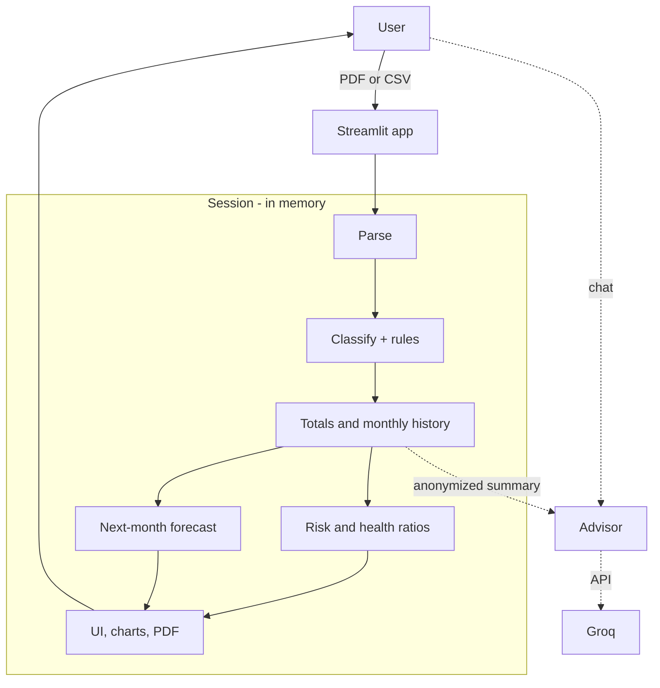

# FinGuide — AI Personal Finance Advisor

**FinGuide** is a Streamlit app for Indian bank statements (PDF/CSV). It parses transactions, classifies spend with ML, forecasts next-month cash flow, scores financial risk, exports a PDF summary, and optionally chats via Groq with **anonymized** context only.

Designed for local runs and **[Streamlit Community Cloud](https://streamlit.io/cloud)** deployment. See [`PRIVACY.md`](PRIVACY.md) for data handling on hosted infrastructure.

## Architecture (high level)



**Training (offline):** notebooks produce `transaction_classifier.pkl` and `cashflow_forecasters.pkl` in `models/`. The live app loads those artifacts; it does not retrain on uploads.

## Features

| Area | What it does |
|------|----------------|
| **Parsing** | Multi-bank PDF layouts (HDFC, SBI, ICICI, Axis, Kotak, etc.) via `parsers/bank_parsers.py`; CSV fallback |
| **Classification** | 5 spend classes from `transaction_classifier.pkl`, plus rule-based **Transfer** / low-confidence **Unclassified** |
| **Totals** | Income = all credits; expenses exclude outbound **Transfer**; net = income − expenses; transfer in/out shown separately |
| **Risk profile** | Rule-based score 0–100 (Low / Medium / High) from savings rate, EMI share, discretionary spend, unclassified share, transfer-heavy outflows, negative forecast net |
| **Forecast** | Next-month expense, income, and net from `cashflow_forecasters.pkl` (Ridge on monthly lags) |
| **Overview** | Risk block, category pie, forecast metrics, financial health ratios (savings, expense, EMI, discretionary) |
| **Spending** | Category table + pie chart (all expense categories with share %) |
| **Transactions** | Full row table with **masked** narrations in the UI |
| **Advisor** | LangChain + Groq chat grounded on anonymized aggregates (no raw statement lines to the API) |
| **PDF export** | Downloadable report: summary, risk, categories, pie + monthly cash-flow charts |

## ML models

Models live in `models/` (gitignored by default — train locally or copy artifacts into your deploy).

### `transaction_classifier.pkl`

- **Task:** Map each transaction to a spend category.
- **Classes:** `Food`, `Shopping`, `Travel`, `EMI`, `Investment`
- **Pipeline:** `ColumnTransformer` with word TF-IDF, character TF-IDF, merchant TF-IDF, plus `amount_log` and `text_len` → `LogisticRegression` (balanced class weights)
- **Training:** `transaction_categorization.ipynb` on `data/financial_transaction_train.csv` / test split; grouped template evaluation for realistic generalization
- **Runtime rules** (`app.py`, no retrain required):
  - Person-to-person / inter-bank transfer patterns → **Transfer**
  - Model confidence &lt; 0.60 (and not Transfer) → **Unclassified**

### `cashflow_forecasters.pkl`

- **Task:** Predict next calendar month’s expense, income, and net cash flow.
- **Models:** Three `Ridge` regressors (expense, income, net) with `StandardScaler`, trained walk-forward in `expense_forecasting.ipynb`
- **Features:** Smoothed monthly series, lag features (`n_lags`), time step, month sin/cos
- **Requirement:** Enough months in the uploaded statement history (`n_lags + 1` months minimum); otherwise the UI shows a short warning

## App sections

- **Overview** — Risk score + reasons, spending pie, next-month forecast, financial health formulas
- **Spending** — Per-category totals, row counts, share %, pie chart
- **Forecast** — Predicted next month + historical monthly income/expense/net line chart
- **Transactions** — All parsed rows (redacted narrations in display)
- **Advisor** — Optional Groq chat (requires API key)

## Project structure

```
finance_advisor_v3/
├── app.py                 # Main Streamlit app
├── ui_components.py       # Theme, charts, metrics, PDF download button
├── privacy_utils.py       # Narration redaction, anonymized LLM context
├── pdf_export.py          # PDF report builder (fpdf2 + matplotlib)
├── parsers/
│   └── bank_parsers.py    # Indian bank PDF extraction
├── models/                # Trained .pkl files (not in git by default)
├── data/                  # Train/test CSVs and synthetic templates
├── transaction_categorization.ipynb
├── expense_forecasting.ipynb
├── scripts/generate_synthetic_transaction_templates.py
├── PRIVACY.md             # Full privacy policy (hosted + local)
├── requirements.txt
├── .env.example
└── setup.sh               # Linux/macOS quick venv setup
```

## Setup

### Linux / macOS

```bash
python3 -m venv .venv
source .venv/bin/activate
pip install -r requirements.txt
```

Or use `setup.sh` on Unix.

### Windows (PowerShell)

```powershell
py -m venv .venv
.\.venv\Scripts\Activate.ps1
pip install -r requirements.txt
```

### Models

Train or refresh artifacts before running the app:

1. Run `transaction_categorization.ipynb` → `models/transaction_classifier.pkl`
2. Run `expense_forecasting.ipynb` → `models/cashflow_forecasters.pkl`

Without these files, the app stops at startup (classifier) or skips forecasting (regressor).

## Environment variables

Copy `.env.example` to `.env` for local development:

| Variable | Required | Description |
|----------|----------|-------------|
| `GROQ_API_KEY` | For Advisor only | Groq API key |
| `GROQ_MODEL` | No | Default: `llama-3.3-70b-versatile` |

**Streamlit Cloud:** set secrets in the app dashboard (do not commit keys). Advisor sends **anonymized totals** only — see `PRIVACY.md`.

## Run locally

```bash
source .venv/bin/activate   # or Windows activate script
streamlit run app.py
```

## Deploy on Streamlit Cloud

1. Push this repo to GitHub (include notebooks and code; add `.pkl` files to the repo or build them in a separate step if your process allows).
2. Create a new app on [share.streamlit.io](https://share.streamlit.io) pointing at `app.py`.
3. Add `GROQ_API_KEY` (and optional `GROQ_MODEL`) under **Secrets** if you want Advisor enabled.
4. Ensure `models/*.pkl` exist in the deployment environment (Cloud cannot use gitignored models unless you commit them or fetch them another way).

Uploads are processed in **session memory** only; FinGuide does not persist statements to disk. The sidebar **Privacy & data** expander summarizes handling; `PRIVACY.md` is the full policy.

## Synthetic data

Generate extra transaction wording templates for training augmentation:

```bash
python scripts/generate_synthetic_transaction_templates.py
```

Output: `data/financial_transaction_synthetic_templates.csv`

## Notes

- **Transfers:** Outbound transfers are excluded from expense totals and spending pies; inbound transfer credits count toward income. This keeps net cash flow aligned with typical statement semantics.
- **Risk vs forecast:** Risk scoring uses expense totals that exclude Transfer; monthly forecast models use raw monthly income/expense stacks from classified rows.
- **Advisor:** Coaching only — not financial advice with guaranteed outcomes. Chat clears on new uploads or **Clear chat**.
- **Evaluation:** Prefer grouped / template-safe metrics in the categorization notebook when judging real-world statement wording.

MIT License
